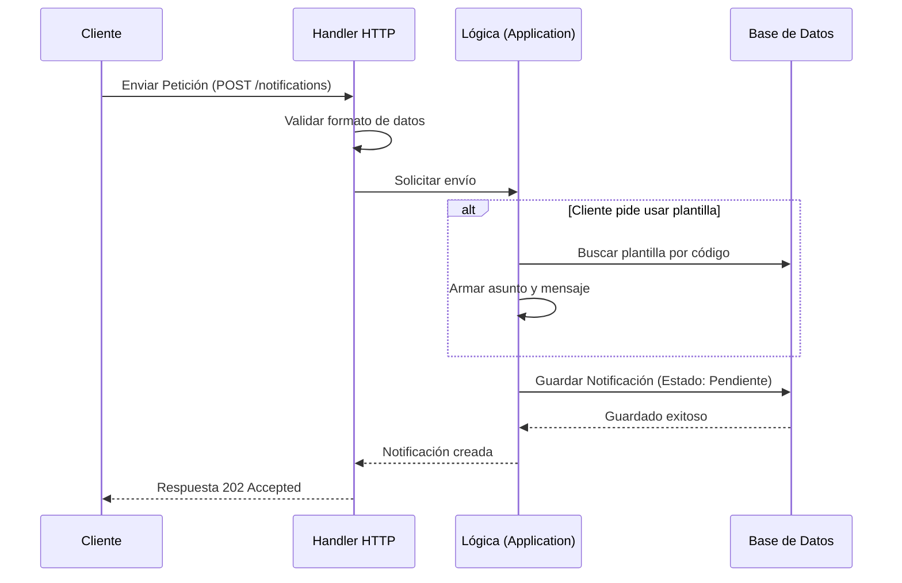

# Evidencia - HU-NOTIF-001: Enviar notificación vía API

## 1. Explicación y abordaje de la Historia de Usuario

Al revisar el código del proyecto, pude entender cómo funciona el envío de notificaciones a través de la API. El microservicio está construido usando una arquitectura hexagonal, lo que significa que el código está organizado en capas separadas para mantener el orden.

Así es como fluye la información cuando solicitamos enviar una notificación:
*   **Capa Adaptadora (La entrada):** Todo empieza en la ruta `POST /notifications`. Aquí hay un controlador (`handler.go`) que recibe la petición HTTP (por ejemplo, desde Postman o una web). Lo primero que hace es verificar que los datos enviados cumplan con lo que espera el sistema. Si todo está bien, convierte esos datos en un "comando" y se los pasa a la siguiente capa.
*   **Capa de Aplicación (El cerebro):** La información llega al caso de uso (`send_notification.go`). Esta es la parte que contiene la lógica. Si en la petición indicamos que queremos usar una "plantilla" de correo, el código la busca en la base de datos y arma el mensaje. Luego, empaqueta la notificación, le asigna un estado de "Pendiente" (Pending) y la manda a guardar.
*   **Respuesta rápida (Patrón Outbox):** Algo muy importante que noté es que el sistema no se queda esperando a que el correo electrónico realmente salga hacia el destinatario para respondernos. Simplemente guarda la notificación en la base de datos y nos responde de inmediato con un código `202 Accepted`. Esto significa "Recibido, yo me encargo de enviarlo más tarde en segundo plano".

---

## 2. Diagrama del Flujo

Para ilustrar mejor cómo funciona, este diagrama muestra el viaje de la petición:

---

## 3. Mejora Propuesta

**Manejo estricto de errores en plantillas inexistentes**
Leyendo la lógica actual, me di cuenta de que si un cliente pide usar una plantilla específica, pero resulta que esa plantilla no existe o está inactiva en la base de datos, el sistema simplemente ignora esto y usa un "asunto" genérico que venía en la petición original. 

*Mi propuesta:* Creo que sería mucho más seguro que el sistema fallara y devolviera un error claro (como un `400 Bad Request`) si no encuentra la plantilla solicitada. Así evitamos enviar un correo genérico e incompleto por accidente a un usuario cuando la verdadera intención era enviarle un diseño específico.

---

## 4. Demostración de Funcionamiento

A continuación, presento la demostración en video donde levanto la infraestructura local (Docker + Go), envío una petición `POST` al endpoint usando la terminal, y demuestro cómo el servidor la recibe y responde exitosamente con el código `202 Accepted`.

🎥 **[PEGAR AQUÍ EL ENLACE AL VIDEO]**
