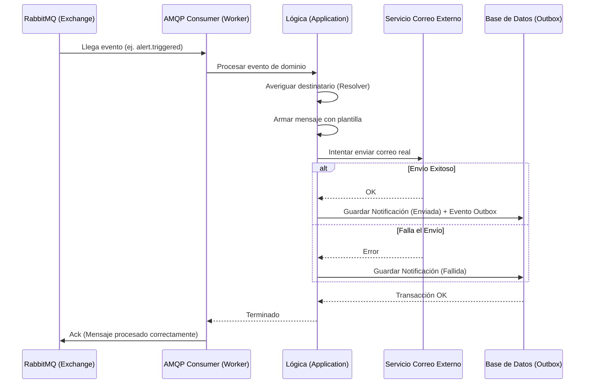

# Evidencia - HU-NOTIF-002: Consumir evento y entregar notificación

## 1. Explicación y abordaje de la Historia de Usuario

Al revisar el código, pude entender cómo el microservicio deja de depender únicamente de peticiones HTTP directas y pasa a trabajar de forma asíncrona, escuchando lo que pasa en otras partes del sistema mediante RabbitMQ (AMQP).

El flujo de trabajo es el siguiente:
*   **Capa Adaptadora (La escucha AMQP):** El archivo `consumer.go` se conecta a RabbitMQ y se suscribe (hace un *bind*) a eventos específicos, como cuando se publica un horario (`scheduling.schedule.published`) o cuando salta una alerta (`monitoring.alert.triggered`). Al llegar un mensaje de estos, lo desempaqueta y se lo pasa a la capa de lógica.
*   **Capa de Aplicación (El cerebro):** En `consume_domain_event.go`, el sistema analiza el tipo de evento recibido. Lo genial aquí es que usa un componente llamado `RecipientResolver` para averiguar automáticamente a quién se le debe notificar (por ejemplo, al instructor afectado por el horario). Luego, arma la notificación usando una plantilla si existe.
*   **El envío real y el Patrón Outbox:** A diferencia de la petición por API donde solo dejábamos la notificación en "Pendiente", aquí el sistema llama al servicio externo (Notifier) e **intenta enviar el correo de inmediato**.
    *   Si se envía exitosamente, guarda la notificación en estado "Enviada" y, **en la misma transacción**, inserta un registro en la tabla de Outbox. Esto sirve para que otro proceso le avise al resto de sistemas que el correo ya fue entregado, asegurando consistencia.

---

## 2. Diagrama del Flujo

Para ilustrar este proceso asíncrono, armé este diagrama de secuencia:



---

## 3. Mejora Propuesta

**Implementar una cola de mensajes muertos (Dead Letter Queue - DLQ)**
Revisando el adaptador `consumer.go`, noté que si llega un mensaje malformado que no se puede leer (formato JSON inválido), el código hace un `Nack` sin encolarlo de nuevo (`no requeue: unparseable message`). Esto significa que el mensaje defectuoso se descarta para siempre sin dejar rastro.

*Mi propuesta:* Debemos configurar en RabbitMQ un Exchange y una Queue de "mensajes muertos" (DLQ). Si un mensaje es inválido, en lugar de eliminarlo definitivamente, lo desviamos hacia la DLQ. Así, el equipo de soporte puede revisar esa cola, ver por qué falló y no perdemos información de eventos que podrían ser importantes. *(El mismo código sugiere que se hará, pero propongo que esto sea un estándar obligatorio desde el inicio en todo consumer).*

---

## 4. Demostración de Funcionamiento

A continuación, presento la demostración en video. En él:
1. Levanto la infraestructura (`docker-compose up -d`).
2. Levanto el worker que escucha eventos ejecutando:
   ```bash
   go run ./cmd/notification-worker
   ```
3. Me dirijo a la interfaz de RabbitMQ (`http://localhost:15672`), selecciono el exchange `scheduling-events` y publico manualmente un mensaje con el routing key `scheduling.schedule.published` y un payload JSON de prueba.
4. En la terminal del worker se observa cómo el evento es consumido, procesado y la notificación marcada como enviada.

🎥 **[PEGAR AQUÍ EL ENLACE AL VIDEO]**
