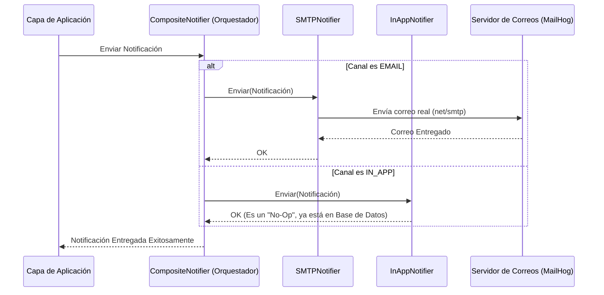

# Evidencia - HU-NOTIF-003: Entrega por canal EMAIL e IN_APP

## 1. Explicación y abordaje de la Historia de Usuario

Al revisar el código, pude ver cómo el microservicio maneja el envío de notificaciones a través de diferentes canales sin volverse un enredo. Para lograrlo, utiliza un patrón de diseño muy útil llamado *Composite* (o Strategy).

Así funciona el mecanismo de entrega:
*   **El Orquestador (CompositeNotifier):** En la capa adaptadora existe un archivo `composite_notifier.go`. Cuando la lógica de la aplicación pide que se envíe una notificación, no le importa cómo se envía, solo se la pasa a este orquestador. Este componente mira el campo "Channel" de la notificación y decide a quién delegarle el trabajo real.
*   **Canal EMAIL:** Si el canal es `EMAIL`, llama al `smtp_notifier.go`. Este adaptador utiliza las funciones nativas de Go (`net/smtp`) para conectarse a un servidor de correos (en nuestro entorno local usa *MailHog*) y envía un correo electrónico real al destinatario.
*   **Canal IN_APP:** Si el canal es `IN_APP`, llama al `inapp_notifier.go`. Curiosamente, este adaptador "no hace nada". Al leer sus comentarios, me di cuenta de que esto es intencional: una notificación "In App" (dentro de la aplicación, como la campanita de Facebook) no necesita enviarse a ningún lado. El simple hecho de que la notificación ya esté guardada en la base de datos es suficiente para que el Frontend la consulte y se la muestre al usuario.

---

## 2. Diagrama del Flujo de Canales

Este diagrama muestra cómo el orquestador divide el trabajo dependiendo del canal elegido:

---

## 3. Mejora Propuesta

**Soporte para correos HTML enriquecidos**
Al revisar el código de `smtp_notifier.go`, noté que el mensaje de correo se arma directamente pegando textos (`fmt.Sprintf`) y se envía como texto plano simple. 

*Mi propuesta:* En el mundo real, los correos de los sistemas suelen ser visualmente atractivos, con logos, botones y colores. Para lograr esto, deberíamos agregar soporte para enviar correos en formato `HTML`. Podríamos inyectar las cabeceras `Content-Type: text/html` en el mensaje armado, o usar una librería de terceros más robusta como `gomail` en lugar de la librería estándar básica `net/smtp`.

---

## 4. Demostración de Funcionamiento

A continuación, presento la demostración en video. En él:
1. Levanto la infraestructura (`docker-compose up -d`) y el API (`go run cmd/notification-api/main.go`).
2. Mediante la terminal (con `curl`), genero una nueva notificación pero esta vez asegurándome de enviar `"channel": "EMAIL"`.
3. Inmediatamente después, abro mi navegador web y entro a la interfaz de **MailHog** (`http://localhost:8025`), que simula nuestra bandeja de entrada de pruebas.
4. En el video se aprecia claramente cómo el correo electrónico real ha llegado a la bandeja de entrada, demostrando que el `SMTPNotifier` hizo su trabajo correctamente.

🎥 **[PEGAR AQUÍ EL ENLACE AL VIDEO]**
