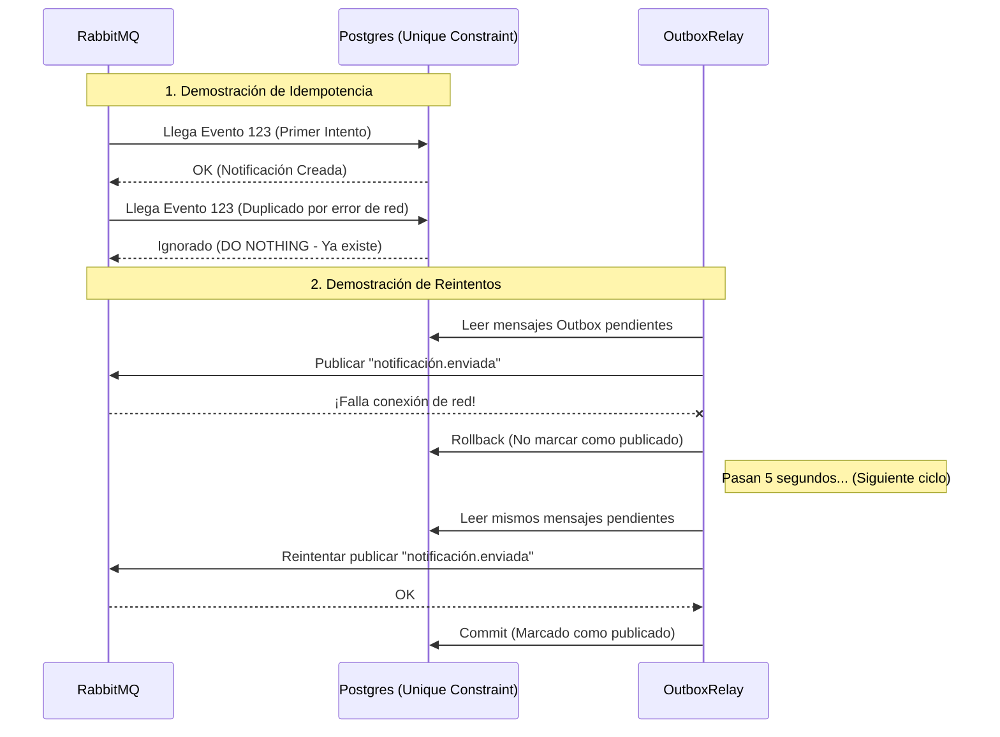

# Evidencia - HU-NOTIF-004: Resiliencia — reintentos, DLQ e idempotencia

## 1. Explicación y abordaje de la Historia de Usuario

Esta historia trata sobre la robustez del sistema: cómo se defiende cuando las cosas salen mal (caídas de red, mensajes duplicados o malformados). Al leer el código, pude identificar tres mecanismos clave:

*   **Idempotencia (No hacer el mismo trabajo dos veces):** RabbitMQ, por naturaleza, puede entregar el mismo mensaje más de una vez ("at-least-once"). Para protegernos, el archivo `pg_repository.go` (método `SaveWithOutbox`) implementa una regla SQL clave: `ON CONFLICT (source_event_id) DO NOTHING`. Si entra un evento con un `source_event_id` que ya procesamos, la base de datos ignora el insert silenciosamente.
*   **Reintentos (Retries) en la publicación:** El componente encargado de avisar al resto del mundo que ya enviamos la notificación es el `outbox_relay.go`. Este componente lee los registros de la base de datos. Si al intentar publicarlos en RabbitMQ ocurre un fallo, la transacción en la base de datos hace un `Rollback()`. Como el estado nunca se actualizó a "Publicado", el worker volverá a leer ese registro e **intentará publicarlo de nuevo** en su siguiente ciclo.
*   **DLQ (Dead Letter Queue):** Analizando la entrada de mensajes en `consumer.go`, el desarrollador dejó claro con un comentario (`no DLQ configured yet`) que actualmente los mensajes malformados que el sistema no entiende simplemente son rechazados (`Nack` sin `requeue`) y **se pierden para siempre**. Aún no existe una verdadera estrategia de retención de mensajes fallidos.

---

## 2. Diagrama de Resiliencia

Este diagrama ilustra cómo el sistema bloquea los eventos duplicados y cómo reintenta la salida de mensajes:

---

## 3. Mejora Propuesta

**Implementar enrutamiento automático a DLQ**
Actualmente, los eventos que no se pueden desencriptar o procesar son destruidos. 

*Mi propuesta:* Configurar directamente en la definición de la cola de RabbitMQ (cuando se ejecuta `QueueDeclare` en `consumer.go`) los argumentos `x-dead-letter-exchange` y `x-dead-letter-routing-key`. De esta manera, cuando hacemos el `d.Nack(false, false)`, RabbitMQ se encargará automáticamente de mover el mensaje defectuoso a una cola de "mensajes muertos". Esto nos permite no perder auditoría y arreglar los problemas sin que los datos se esfumen.

---

## 4. Demostración de Funcionamiento

Para grabar la evidencia de idempotencia:
1. Levanta el microservicio (`docker-compose up -d` y `go run cmd/notification-api/main.go`).
2. Haz una petición `POST /notifications` idéntica a la de la HU-001, pero asegúrate de incluirle manualmente un campo `"source_event_id": "11111111-2222-3333-4444-555555555555"`.
3. Verás que responde `202 Accepted` y en consola se registra el guardado.
4. **En tu video, ejecuta inmediatamente el MISMO comando `curl` con el mismo `source_event_id`:** Verás que, aunque responda `202`, al revisar la base de datos o los logs no se habrá creado un correo duplicado, demostrando que el sistema es completamente **idempotente**.

🎥 **[PEGAR AQUÍ EL ENLACE AL VIDEO]**
