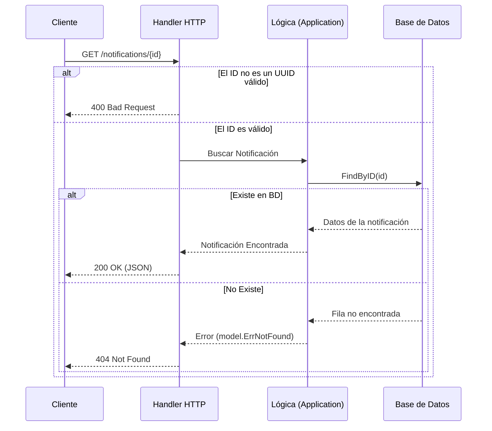

# Evidencia - HU-NOTIF-005: Consultar notificación enviada

## 1. Explicación y abordaje de la Historia de Usuario

Al analizar el código para la consulta de notificaciones, me encontré con un flujo muy limpio y directo. Se encarga de permitir la lectura de una notificación previamente guardada usando su ID único.

Así funciona la consulta paso a paso:
*   **Capa Adaptadora (Entrada HTTP):** Todo comienza en el archivo `handler.go` a través de una petición `GET /notifications/{id}`. Antes de hacer cualquier cosa, el sistema verifica que el texto ingresado en el `{id}` sea un formato "UUID" válido. Si metemos cualquier otra cosa, el sistema corta el flujo ahí mismo y responde con un `400 Bad Request`.
*   **Capa de Aplicación (Caso de Uso):** Si el ID es válido, se lo entrega al archivo `get_notification.go`. Este caso de uso es bastante sencillo: solo le pide al repositorio de base de datos que busque esa notificación exacta.
*   **Base de Datos y Respuesta:** El `pg_repository.go` hace el `SELECT` a la tabla. Si la notificación existe, se devuelve hasta arriba y el API responde con un `200 OK` y los datos en JSON. Pero si la notificación no existe, el caso de uso levanta un error especial (`model.ErrNotFound`), que el API sabe traducir de forma elegante como un `404 Not Found`.

---

## 2. Diagrama del Flujo

En este diagrama se puede ver cómo viaja la petición de consulta:



---

## 3. Mejora Propuesta

**Validación de Permisos (Authorization/Ownership)**
Actualmente, cualquier sistema o usuario que logre obtener o adivinar un UUID válido de una notificación, puede hacer una petición GET y ver su contenido.

*Mi propuesta:* Pensando en la seguridad, sería ideal implementar una validación de pertenencia. Es decir, que el endpoint no solo reciba el `{id}` de la notificación, sino que también verifique (a través de los Headers que pase el API Gateway o el token JWT) si el usuario que está haciendo la consulta es realmente el dueño (`recipient_id`) de esa notificación, devolviendo un `403 Forbidden` en caso de que alguien intente husmear notificaciones ajenas.

---

## 4. Demostración de Funcionamiento

Para grabar la demostración de esta HU:
1. Levanta el proyecto (`docker-compose up -d` y `go run cmd/notification-api/main.go`).
2. Primero, genera una notificación usando el `POST` (como en la HU-001) y **copia el campo `id`** que te devuelve la respuesta.
3. Ahora, abre una nueva terminal (o usa Postman) y haz un `GET` a esa URL usando el ID que copiaste:
   ```bash
   curl -X GET http://localhost:8080/notifications/PON-EL-ID-AQUI
   ```
4. Verás cómo te devuelve el JSON con los datos de tu notificación y un código HTTP `200 OK`.
5. *(Opcional para el video)* Puedes intentar cambiar un número del ID para que el servidor no la encuentre y demostrar cómo responde con el `404 Not Found`.

🎥 **[PEGAR AQUÍ EL ENLACE AL VIDEO]**
