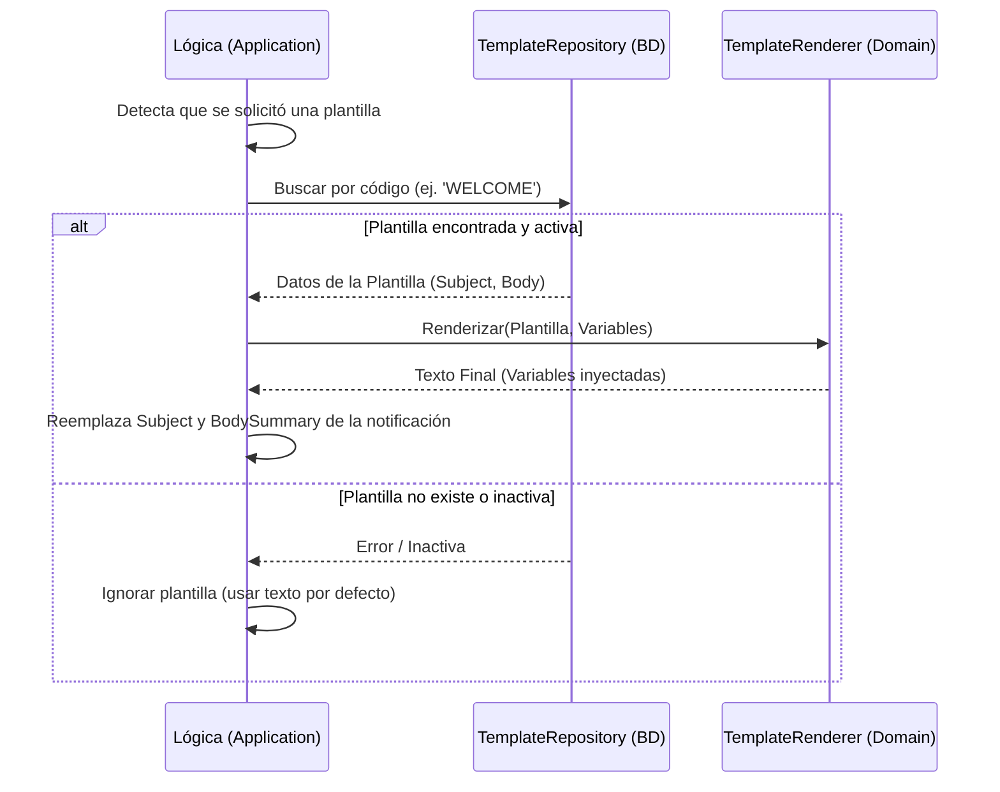

# Evidencia - HU-NOTIF-006: Plantillas de notificación

## 1. Explicación y abordaje de la Historia de Usuario

Esta historia le da al sistema la capacidad de enviar mensajes dinámicos sin que los clientes tengan que redactar todo el correo o notificación desde cero cada vez. Funciona gracias a un sistema de plantillas.

Al analizar el código, así es como se implementó:
*   **Capa de Dominio (Lógica pura):** En la carpeta `domain/service`, encontré el archivo `template_renderer.go`. Tiene una función súper sencilla pero importante: toma un texto que tiene "variables" envueltas en llaves (ejemplo: `Hola {{nombre}}`) y las reemplaza por los valores reales que le llegan en un diccionario (`map`).
*   **Capa Adaptadora (Base de Datos):** Existe un repositorio especializado (`pg_template_repository.go`) que se encarga exclusivamente de ir a la base de datos a buscar plantillas usando un código único, por ejemplo, `ALERT_TRIGGERED`.
*   **Capa de Aplicación (La Orquestación):** En los casos de uso que ya vimos antes (como enviar por API o consumir un evento AMQP), el sistema hace una pausa antes de armar la notificación final. Si se indicó un `template_code`, va a la base de datos, extrae la plantilla y llama al servicio de dominio para "renderizarla" inyectando las variables reales (`template_vars`). Si la plantilla está inactiva o no existe, usa los textos por defecto para no fallar.

---

## 2. Diagrama del Flujo de Plantillas

Este diagrama muestra cómo se interrumpe el flujo normal para "armar" el mensaje usando la base de datos y el motor de plantillas:



---

## 3. Mejora Propuesta

**Sustituir `strings.ReplaceAll` por el motor oficial `text/template`**
Al revisar `template_renderer.go`, el renderizado es literalmente un reemplazo de texto básico ("busca X y reemplázalo por Y").

*Mi propuesta:* Deberíamos usar la librería estándar de Go `text/template` (o `html/template`). Esto nos daría superpoderes en las plantillas. En lugar de solo reemplazar palabras, los administradores podrían crear plantillas con lógica, como condicionales (`{{if .es_instructor}}...{{else}}...{{end}}`), o ciclos para mostrar listas, todo directamente desde la base de datos sin tener que cambiar el código fuente.

---

## 4. Demostración de Funcionamiento

Para la demostración en video:
1. Asegúrate de tener levantado el entorno (`docker-compose up -d` y `go run cmd/notification-api/main.go`).
2. Vas a usar el endpoint `POST /notifications` (vía `curl` o Postman), enviando en el payload un código de plantilla y las variables necesarias.
   ```bash
   curl -X POST http://localhost:8080/notifications \
     -H "Content-Type: application/json" \
     -d '{
       "recipient_id": "123e4567-e89b-12d3-a456-426614174000",
       "recipient_email": "aprendiz@sena.edu.co",
       "channel": "EMAIL",
       "subject": "Este asunto será ignorado si la plantilla existe",
       "template_code": "ALERT_TRIGGERED",
       "template_vars": {
         "alert_type": "Falla de Sistema",
         "ficha": "3145555"
       }
     }'
   ```
3. Muestra cómo la API responde `202 Accepted`. *(Opcionalmente, si abres MailHog, podrás ver cómo llegó el correo con las variables inyectadas).*

🎥 **[PEGAR AQUÍ EL ENLACE AL VIDEO]**
