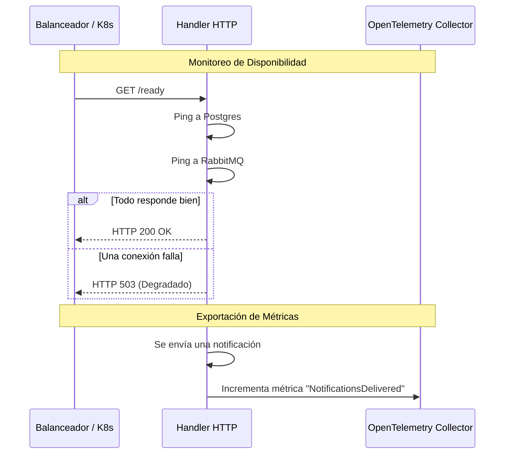

# Evidencia - HU-NOTIF-007: Observabilidad OTel (HTTP + AMQP) y health

## 1. Explicación y abordaje de la Historia de Usuario

Esta historia garantiza que el microservicio no sea una "caja negra" en producción. Al leer el código, identifiqué tres grandes frentes de observabilidad:

*   **Endpoints de Salud (Health & Ready):** En `handler.go`, se configuraron dos rutas. El endpoint `/health` actúa como un "Liveness Probe", devolviendo 200 siempre que la aplicación no se haya caído. El endpoint `/ready` es un "Readiness Probe" más inteligente: antes de devolver OK, hace un `Ping()` real a la Base de Datos (Postgres) y al Broker (RabbitMQ) para confirmar que las conexiones funcionan.
*   **Métricas de Negocio:** En el `composite_notifier.go`, implementaron un contador de OpenTelemetry (`NotificationsDelivered`). Cada vez que procesa una notificación, suma "+1" y le pega etiquetas (tags) indicando si fue por canal `EMAIL` o `IN_APP` y si falló o fue exitoso.
*   **Trazas (Traces) HTTP y Asíncronas:** Las peticiones web se trazan automáticamente usando la librería `otelhttp`. Pero el verdadero desafío resuelto está en AMQP (`consumer.go` y `outbox_relay.go`). Al recibir un evento de RabbitMQ, el sistema "extrae" un header llamado `traceparent`. Lo asombroso es que ese código guarda este identificador de traza junto con el evento en la tabla Outbox. Así, cuando el Relay finalmente publica el mensaje de salida horas después, la traza no se rompe y sigue conectada al evento original en los sistemas de monitoreo.

---

## 2. Diagrama de Salud y Trazas

El siguiente diagrama ilustra cómo funcionan las revisiones de salud y cómo se conectan las trazas con el ecosistema externo:



---

## 3. Mejora Propuesta

**Caché en segundo plano para el Readiness Probe**
Al revisar el código de `ready()`, noté que cada vez que alguien entra a la ruta `/ready`, el servidor hace un "Ping" real e inmediato a la base de datos y a RabbitMQ de forma síncrona.

*Mi propuesta:* Si un balanceador de cargas (como Kubernetes o NGINX) revisa agresivamente este endpoint miles de veces, o sufrimos un ataque DDoS, estaríamos enviando una tormenta de Pings a la base de datos, lo cual podría tumbarla. Sería mejor tener un pequeño proceso en segundo plano (background worker) que haga el Ping cada 10 segundos y guarde el resultado en memoria RAM. Así, cuando llamen al `/ready`, simplemente devolvemos la última variable leída de la RAM, protegiendo nuestra infraestructura.

---

## 4. Demostración de Funcionamiento

Para grabar el video de la demostración:
1. Asegúrate de tener levantado el entorno (`docker-compose up -d` y `go run cmd/notification-api/main.go`).
2. En otra terminal ejecuta un chequeo de salud:
   ```bash
   curl -X GET http://localhost:8080/health
   ```
   *Debe responder `{"status":"ok"}`.*
3. Ejecuta el chequeo de "listo" (Readiness):
   ```bash
   curl -X GET http://localhost:8080/ready
   ```
   *Debe mostrar que la conexión a DB y AMQP es exitosa.*
4. **¡Para que el video sea genial!** Apaga la base de datos de Docker a propósito (`docker stop design-software-notification-db`) y vuelve a ejecutar el paso 3. En el video se verá cómo el microservicio inteligentemente se da cuenta y responde con un código **HTTP 503 Service Unavailable**, demostrando que la sonda de salud funciona perfecto.

🎥 **[PEGAR AQUÍ EL ENLACE AL VIDEO]**
