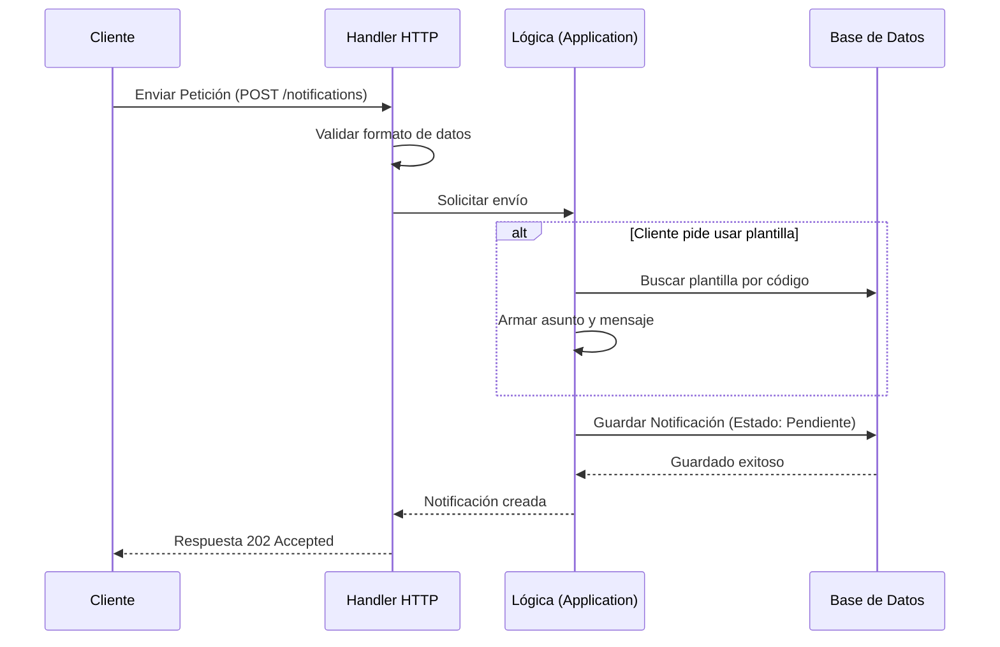

# Evidencia - HU-NOTIF-001: Enviar notificación vía API

## 1. Explicación y abordaje de la Historia de Usuario

Al revisar el código, identifiqué cómo el microservicio procesa el envío de notificaciones mediante una Arquitectura Hexagonal:

*   **Capa Adaptadora (Entrada):** La ruta `POST /notifications` (en `handler.go`) recibe la petición HTTP, valida el formato de los datos y los envía a la siguiente capa.
*   **Capa de Aplicación (Lógica):** El caso de uso (`send_notification.go`) recibe los datos. Si se indica una plantilla, la busca y arma el mensaje. Luego, marca la notificación como "Pendiente" y la envía a guardar.
*   **Respuesta rápida:** El sistema guarda la notificación en Base de Datos y responde inmediatamente con un `202 Accepted` (Patrón Outbox). No espera a que el correo se envíe de verdad, dejando esa tarea pesada para un proceso en segundo plano.

---

## 2. Diagrama del Flujo

Para ilustrar mejor cómo funciona, este diagrama muestra el viaje de la petición:



---

## 3. Mejora Propuesta

**Manejo estricto de errores en plantillas inexistentes**
Leyendo la lógica actual, me di cuenta de que si un cliente pide usar una plantilla específica, pero resulta que esa plantilla no existe o está inactiva en la base de datos, el sistema simplemente ignora esto y usa un "asunto" genérico que venía en la petición original. 

*Mi propuesta:* Creo que sería mucho más seguro que el sistema fallara y devolviera un error claro (como un `400 Bad Request`) si no encuentra la plantilla solicitada. Así evitamos enviar un correo genérico e incompleto por accidente a un usuario cuando la verdadera intención era enviarle un diseño específico.

---

## 4. Demostración de Funcionamiento

A continuación, presento la evidencia en captura de pantalla individual. 

**Pasos para ejecutar la prueba:**
1. Levanta la infraestructura:
   ```bash
   docker-compose up -d
   ```
2. Inicia la API del microservicio:
   ```bash
   go run ./cmd/notification-api
   ```
3. En otra terminal, envía la petición POST:
   ```bash
   curl -X POST http://localhost:8080/notifications \
     -H "Content-Type: application/json" \
     -d '{
       "recipient_id": "123e4567-e89b-12d3-a456-426614174000",
       "recipient_email": "aprendiz@sena.edu.co",
       "channel": "EMAIL",
       "subject": "Notificación de Prueba",
       "body_summary": "Este es un mensaje de prueba para la HU-001."
     }'
   ```
4. El servidor responderá con un código `202 Accepted`, demostrando que la ruta funciona y guarda el mensaje.


**Conclusión de la Evidencia:** 
En esta demostración se comprobó el correcto funcionamiento de la capa adaptadora HTTP. Se evidenció cómo el sistema recibe una solicitud, delega la carga de trabajo de manera asíncrona mediante el Patrón Outbox, y devuelve una respuesta inmediata `202 Accepted` garantizando el alto rendimiento del API sin bloquear al cliente.
