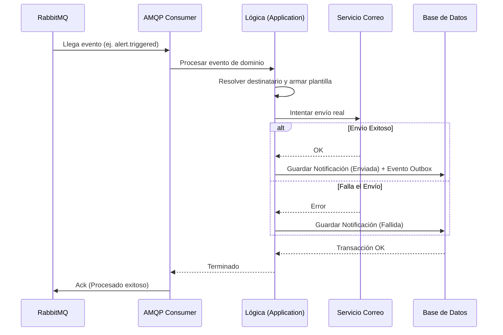

# Evidencia - HU-NOTIF-002: Consumir evento y entregar notificación

## 1. Explicación y abordaje de la Historia de Usuario

Al revisar el código, identifiqué cómo el microservicio procesa eventos asíncronos mediante una Arquitectura Hexagonal:

*   **Capa Adaptadora (Entrada AMQP):** El archivo `consumer.go` se conecta a RabbitMQ y escucha eventos como `scheduling.schedule.published`. Al recibir un mensaje, lo desempaqueta y se lo pasa a la lógica de negocio.
*   **Capa de Aplicación (Lógica):** En `consume_domain_event.go`, el sistema utiliza un `RecipientResolver` para averiguar a quién notificar. Arma el correo usando una plantilla (si existe) y se lo pasa al `Notifier` para envío inmediato.
*   **Patrón Outbox:** Si el correo se envía con éxito, el sistema guarda la notificación en Base de Datos como "Enviada" e inserta un evento en la tabla Outbox *en la misma transacción*, garantizando consistencia.

---

## 2. Diagrama del Flujo



---

## 3. Mejora Propuesta

**Implementar una Dead Letter Queue (DLQ)**
Actualmente, si llega un mensaje malformado a `consumer.go`, se hace un `Nack` sin encolarlo de nuevo, perdiéndose para siempre. 
*Propuesta:* Configurar un Exchange de "mensajes muertos" (DLQ) en RabbitMQ. Así, los mensajes inválidos se desvían a una cola especial para que soporte pueda revisarlos, sin perder información crítica.

---

## 4. Demostración de Funcionamiento

A continuación, presento la evidencia en captura de pantalla individual.

**Pasos para ejecutar la prueba:**
1. Levanta la infraestructura:
   ```bash
   docker-compose up -d
   ```
2. Inicia el worker del microservicio:
   ```bash
   go run ./cmd/notification-worker
   ```
3. Dirígete a la interfaz de RabbitMQ (`http://localhost:15672`).
4. Ve a la pestaña **Exchanges**, selecciona `scheduling-events`.
5. En la sección **Publish message**, usa el Routing key: `scheduling.schedule.published`
6. En **Payload**, pega este JSON y haz clic en "Publish message":
   ```json
   {
     "event_id": "11111111-2222-3333-4444-555555555555",
     "event_type": "scheduling.schedule.published",
     "source_service": "scheduling-service",
     "timestamp": "2026-08-18T10:00:00Z",
     "version": "1.0",
     "payload": {
       "published_by": "123e4567-e89b-12d3-a456-426614174000",
       "schedule_name": "Horario Mañana",
       "ficha": "3145555"
     }
   }
   ```
7. En la terminal del worker verás cómo el evento es consumido y procesado correctamente.

🖼️ **[PEGAR AQUÍ LA CAPTURA DE PANTALLA INDIVIDUAL]**

---

**Conclusión de la Evidencia:** 
Esta demostración comprobó la capacidad reactiva del microservicio. Se evidenció la correcta suscripción al broker de mensajería (RabbitMQ), el consumo exitoso de un evento de dominio externo y su procesamiento inmediato, operando de forma totalmente desacoplada.
