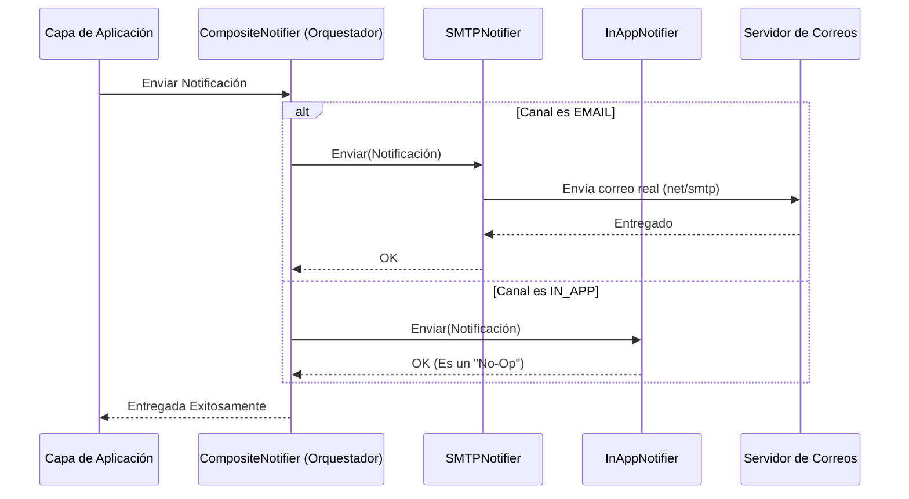

# Evidencia - HU-NOTIF-003: Entrega por canal EMAIL e IN_APP

## 1. Explicación y abordaje de la Historia de Usuario

El microservicio maneja múltiples canales de comunicación utilizando el patrón de diseño **Composite**:

*   **El Orquestador:** `composite_notifier.go` recibe la orden de enviar una notificación. Lee el campo "Channel" y delega el trabajo al adaptador correspondiente.
*   **Canal EMAIL:** Si el canal es `EMAIL`, el `smtp_notifier.go` se conecta vía la librería estándar `net/smtp` al servidor de correos (MailHog) y envía un correo electrónico real.
*   **Canal IN_APP:** Si el canal es `IN_APP`, el `inapp_notifier.go` actúa como un "No-Op" (no hace nada). Esto es correcto porque una notificación In-App no se envía por internet; basta con que se guarde en la Base de Datos para que el frontend la consulte.

---

## 2. Diagrama del Flujo de Canales



---

## 3. Mejora Propuesta

**Soporte para correos HTML enriquecidos**
Actualmente el `smtp_notifier.go` arma el mensaje concatenando strings simples (`fmt.Sprintf`) enviando texto plano.
*Propuesta:* Utilizar una librería robusta como `gomail` o inyectar cabeceras `Content-Type: text/html` para permitir correos visualmente atractivos (con logos y botones) mejorando la experiencia del usuario final.

---

## 4. Demostración de Funcionamiento

A continuación, presento la evidencia en captura de pantalla individual.

**Pasos para ejecutar la prueba:**
1. Levanta la infraestructura y la API:
   ```bash
   docker-compose up -d
   go run ./cmd/notification-api
   ```
2. Envía una notificación forzando el canal `EMAIL`:
   ```bash
   curl -X POST http://localhost:8080/notifications \
     -H "Content-Type: application/json" \
     -d '{
       "recipient_id": "123e4567-e89b-12d3-a456-426614174000",
       "recipient_email": "aprendiz@sena.edu.co",
       "channel": "EMAIL",
       "subject": "Aviso Urgente",
       "body_summary": "Este mensaje llegará a la bandeja."
     }'
   ```
3. Abre tu navegador y entra a **MailHog**: `http://localhost:8025`.
4. Muestra en el video que el correo llegó a la bandeja de entrada, demostrando que el `SMTPNotifier` funcionó correctamente.


---

**Conclusión de la Evidencia:** 
En este ejercicio se validó la implementación del Patrón Composite. Se demostró cómo el orquestador de canales discrimina exitosamente la petición (EMAIL) e invoca correctamente al proveedor externo (MailHog a través de SMTP) entregando el correo de forma efectiva.
