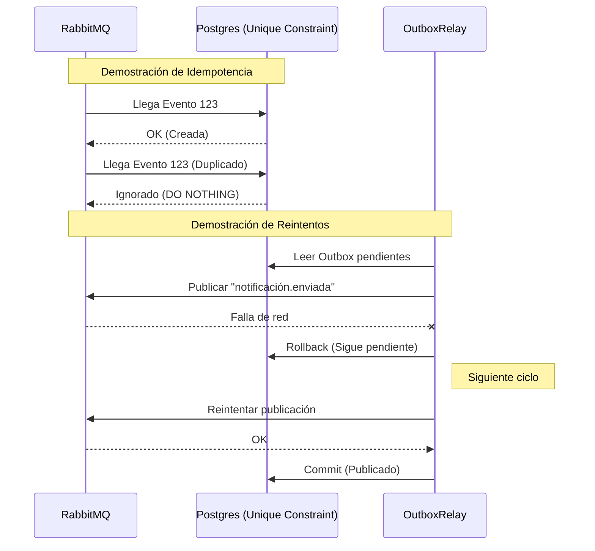

# Evidencia - HU-NOTIF-004: Resiliencia — reintentos, DLQ e idempotencia

## 1. Explicación y abordaje de la Historia de Usuario

El sistema se defiende de fallos (caídas de red o mensajes duplicados) mediante tres mecanismos:

*   **Idempotencia:** En `pg_repository.go`, la regla SQL `ON CONFLICT (source_event_id) DO NOTHING` ignora inserciones si un evento de RabbitMQ nos llega duplicado, evitando spam.
*   **Reintentos (Outbox):** El `outbox_relay.go` publica eventos hacia RabbitMQ. Si la red falla a la mitad, la transacción en BD hace `Rollback()`. Así, el evento no se marca como publicado y el Worker volverá a intentarlo en su próximo ciclo automáticamente.
*   **DLQ:** Se identificó en el código de `consumer.go` que aún no hay un manejo real de mensajes erróneos (se usa un `Nack` destructivo).

---

## 2. Diagrama de Resiliencia



---

## 3. Mejora Propuesta

**Implementar enrutamiento automático a DLQ**
*Propuesta:* Al declarar la cola de consumo en `consumer.go`, añadir los argumentos `x-dead-letter-exchange` para que los mensajes rechazados (`Nack`) por estar corruptos pasen automáticamente a una cola muerta para su revisión humana, en lugar de perderlos permanentemente.

---

## 4. Demostración de Funcionamiento

A continuación, presento la evidencia en captura de pantalla individual probando la Idempotencia.

**Pasos para ejecutar la prueba:**
1. Levanta el entorno y la API:
   ```bash
   docker-compose up -d
   go run ./cmd/notification-api
   ```
2. Ejecuta un `POST` inyectando un `source_event_id` específico:
   ```bash
   curl -X POST http://localhost:8080/notifications \
     -H "Content-Type: application/json" \
     -d '{
       "recipient_id": "123e4567-e89b-12d3-a456-426614174000",
       "recipient_email": "aprendiz@sena.edu.co",
       "channel": "IN_APP",
       "subject": "Prueba Idempotencia",
       "source_event_id": "99999999-9999-9999-9999-999999999999"
     }'
   ```
3. Ejecuta **exactamente el mismo comando `curl` de nuevo**.
4. Muestra la base de datos (o haz un GET listando) para demostrar que, aunque enviaste dos peticiones idénticas, solo se guardó un registro en BD.

🖼️ **[PEGAR AQUÍ LA CAPTURA DE PANTALLA INDIVIDUAL]**

---

**Conclusión de la Evidencia:** 
Esta prueba validó los mecanismos de resiliencia del sistema. Al inyectar eventos duplicados intencionalmente, se demostró cómo la restricción de unicidad en Postgres (Idempotencia) protege eficazmente al microservicio de enviar spam o procesar cargas redundantes ante fallos en la red.
