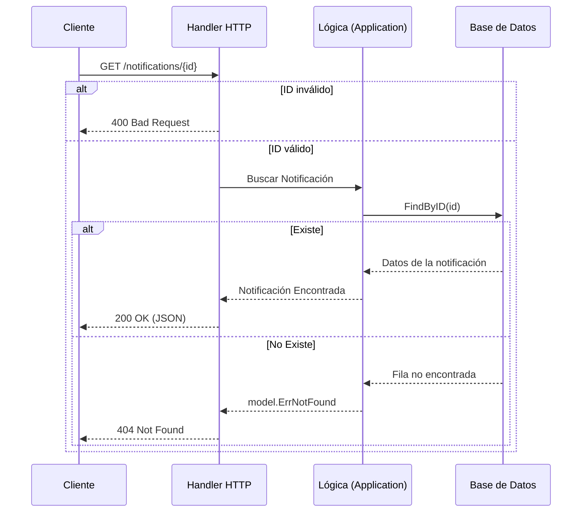

# Evidencia - HU-NOTIF-005: Consultar notificación enviada

## 1. Explicación y abordaje de la Historia de Usuario

El endpoint de consulta (`GET /notifications/{id}`) tiene un flujo de lectura muy limpio:

*   **Capa Adaptadora (HTTP):** El archivo `handler.go` valida inmediatamente que el texto de la URL sea un UUID correcto. Si es basura, responde un `400 Bad Request` antes de molestar a la base de datos.
*   **Capa de Aplicación:** `get_notification.go` recibe el UUID y pide al repositorio buscar ese ID.
*   **Manejo de Respuestas:** Si el `pg_repository.go` encuentra la fila, devuelve un `200 OK` con el JSON. Si no la encuentra, arroja el error de dominio `model.ErrNotFound`, que el API traduce automáticamente a un `404 Not Found`.

---

## 2. Diagrama del Flujo



---

## 3. Mejora Propuesta

**Validación de Permisos (Ownership)**
Actualmente, cualquier persona con un UUID válido puede ver una notificación, ya que el endpoint no valida a quién le pertenece.
*Propuesta:* Verificar a través de Headers o JWT del API Gateway que el usuario consultando sea el verdadero dueño (`recipient_id`) de la notificación, devolviendo un `403 Forbidden` si intenta leer notificaciones ajenas.

---

## 4. Demostración de Funcionamiento

A continuación, presento la evidencia en captura de pantalla individual.

**Pasos para ejecutar la prueba:**
1. Levanta la API (`go run ./cmd/notification-api`).
2. Genera una notificación con el POST de la HU-001 y **copia el campo `id`** de la respuesta (ejemplo: `6d8b...`).
3. En la terminal, consulta esa notificación (reemplaza EL-ID):
   ```bash
   curl -X GET http://localhost:8080/notifications/EL-ID
   ```
4. El servidor te devolverá los datos de la notificación con un código `200 OK`.
5. Cambia el último número del ID e inténtalo de nuevo para demostrar cómo el servidor responde con un `404 Not Found`.

🖼️ **[PEGAR AQUÍ LA CAPTURA DE PANTALLA INDIVIDUAL]**

---

**Conclusión de la Evidencia:** 
A través de esta demostración se validó el flujo de consulta de estado del sistema. Quedó en evidencia el manejo adecuado de errores por parte del API HTTP, traduciendo exitosamente una excepción de dominio (No Encontrado) en un código de estado `404 Not Found` apropiado para clientes REST.
