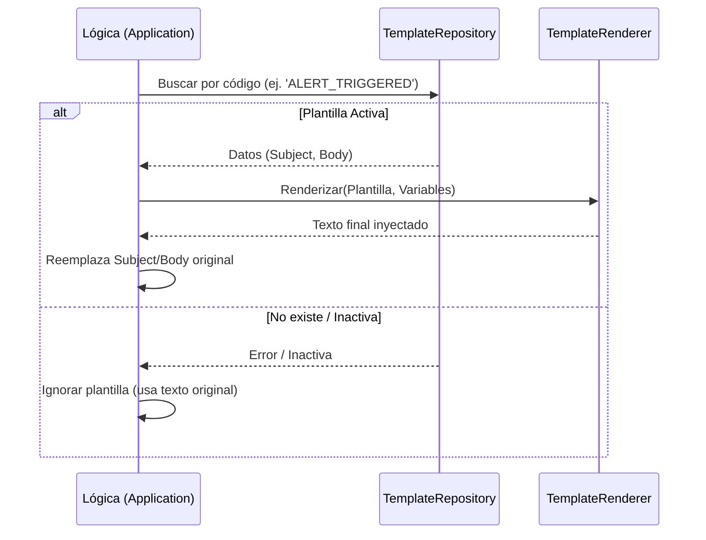

# Evidencia - HU-NOTIF-006: Plantillas de notificación

## 1. Explicación y abordaje de la Historia de Usuario

El uso de plantillas evita que los clientes envíen el texto del correo completo cada vez.

*   **Capa de Dominio:** `template_renderer.go` ofrece un servicio puro que reemplaza variables tipo `{{clave}}` por sus valores reales utilizando diccionarios (`map`).
*   **Capa Adaptadora:** `pg_template_repository.go` lee el formato de la plantilla directamente desde la Base de Datos usando un código (ej. `ALERT_TRIGGERED`).
*   **Capa de Aplicación:** Antes de enviar el correo, la lógica verifica si se incluyó un `template_code`. De ser así, extrae la plantilla, inyecta los `template_vars` proporcionados, y sobreescribe el asunto y cuerpo de la notificación antes de guardarla.

---

## 2. Diagrama del Flujo de Plantillas



---

## 3. Mejora Propuesta

**Pasar a `text/template` oficial de Go**
El código actual realiza reemplazos simples con `strings.ReplaceAll`.
*Propuesta:* Utilizar el motor nativo `text/template` de Go. Esto habilitaría lógicas poderosas dentro de la base de datos como bucles (`range`) para listas o condicionales (`if`), haciendo los correos mucho más dinámicos sin tocar código fuente.

---

## 4. Demostración de Funcionamiento

A continuación, presento la demostración en video.

**Pasos para ejecutar la prueba:**
1. Levanta la API (`go run ./cmd/notification-api`).
2. Envía una petición `POST` solicitando explícitamente el uso de una plantilla (la base de datos debe tener semillas/seeds con `ALERT_TRIGGERED`):
   ```bash
   curl -X POST http://localhost:8080/notifications \
     -H "Content-Type: application/json" \
     -d '{
       "recipient_id": "123e4567-e89b-12d3-a456-426614174000",
       "recipient_email": "aprendiz@sena.edu.co",
       "channel": "EMAIL",
       "subject": "Asunto genérico (será sobreescrito)",
       "template_code": "ALERT_TRIGGERED",
       "template_vars": {
         "alert_type": "Servidor Caído",
         "ficha": "3145555"
       }
     }'
   ```
3. Realiza un `GET` con el ID generado para demostrar que el "Asunto" (Subject) guardado en base de datos contiene los textos de tus variables (`Servidor Caído`) y no el texto genérico inicial.

🎥 **[PEGAR AQUÍ EL ENLACE AL VIDEO]**

---

**Conclusión del Video:** 
El video demostró la integración del servicio de renderizado de plantillas. Se evidenció cómo el sistema consulta la base de datos, extrae la plantilla dinámica configurada (`ALERT_TRIGGERED`) e inyecta correctamente las variables de negocio en tiempo de ejecución antes de consolidar el mensaje final.
