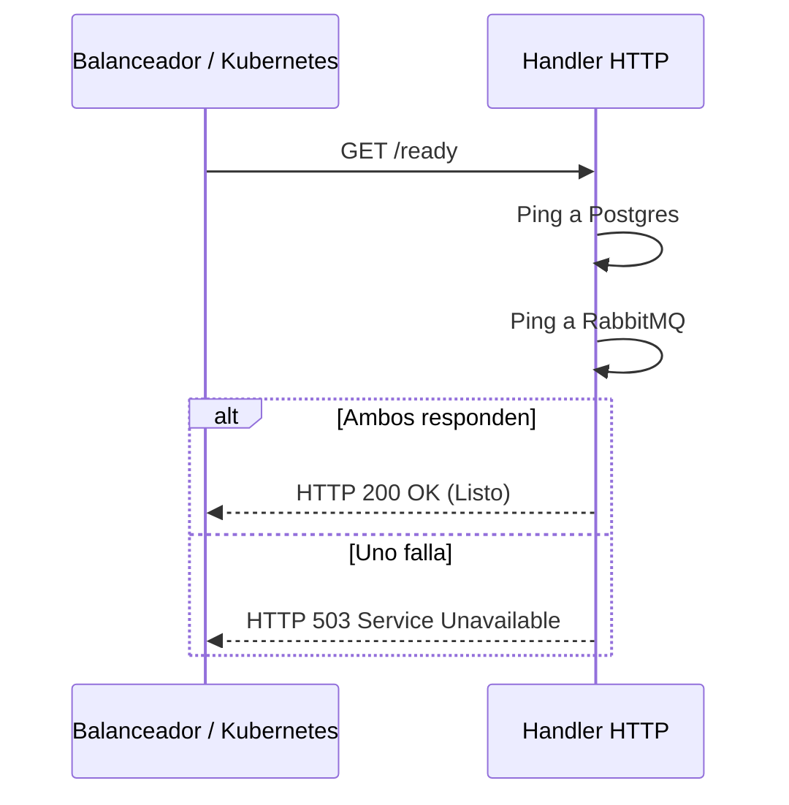

# Evidencia - HU-NOTIF-007: Observabilidad OTel (HTTP + AMQP) y health

## 1. Explicación y abordaje de la Historia de Usuario

El microservicio utiliza monitoreo profundo para no ser una "caja negra":

*   **Salud (Health/Ready):** La ruta `/health` sirve como Liveness Probe (devuelve `200` si la app funciona). La ruta `/ready` actúa como Readiness Probe: hace "Pings" reales a Postgres y RabbitMQ asegurando que el microservicio esté verdaderamente listo para procesar datos.
*   **Métricas de Negocio:** `composite_notifier.go` envía métricas a OpenTelemetry contabilizando cuántos correos se entregan y por qué canal.
*   **Trazas Inmortales (AMQP):** Al consumir mensajes de RabbitMQ, el código extrae el `traceparent` (Trace ID) y lo guarda en la tabla Outbox. Así, al publicar la respuesta horas después, la traza nunca se rompe en los sistemas de monitoreo.

---

## 2. Diagrama de Salud



---

## 3. Mejora Propuesta

**Caché en segundo plano para Readiness Probe**
Actualmente `/ready` ejecuta un Ping sincrónico a las bases de datos en tiempo real.
*Propuesta:* Si el balanceador hace demasiadas peticiones (o en caso de ataque DDoS), se saturará la base de datos de "Pings". Es mejor implementar un *background worker* que haga el ping cada 10 segundos y actualice una variable en RAM, para que el endpoint responda al instante leyendo solo la RAM.

---

## 4. Demostración de Funcionamiento

A continuación, presento la evidencia en captura de pantalla individual.

**Pasos para ejecutar la prueba:**
1. Asegúrate de tener levantado el entorno (`docker-compose up -d`) y la API (`go run ./cmd/notification-api`).
2. Prueba la sonda de vida (Liveness):
   ```bash
   curl -i -X GET http://localhost:8080/health
   ```
   *Respuesta esperada: `200 OK` con `{"status":"ok"}`.*
3. Prueba la sonda operativa (Readiness):
   ```bash
   curl -i -X GET http://localhost:8080/ready
   ```
   *Respuesta esperada: `200 OK`.*
4. **Apaga la BD temporalmente:** Abre otra terminal y apaga Postgres con: `docker stop design-software-notification-db`
5. Vuelve a ejecutar el paso 3. El microservicio reaccionará devolviendo un `503 Service Unavailable`, demostrando su capacidad de autodiagnóstico. *(Luego, vuélvela a prender con `docker start design-software-notification-db`).*

🖼️ **[PEGAR AQUÍ LA CAPTURA DE PANTALLA INDIVIDUAL]**

---

**Conclusión de la Evidencia:** 
En esta prueba se validaron las sondas de observabilidad (Liveness y Readiness). Al simular la caída intencional de la base de datos, se comprobó cómo el microservicio tiene la capacidad de autodiagnosticarse profundamente, cambiando su estado a inoperativo (`503`) para prevenir pérdidas de datos.
